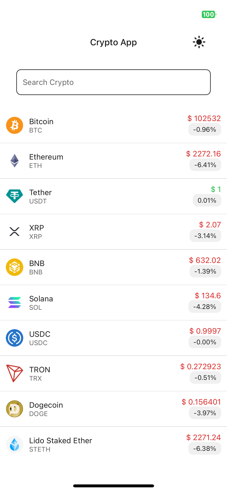
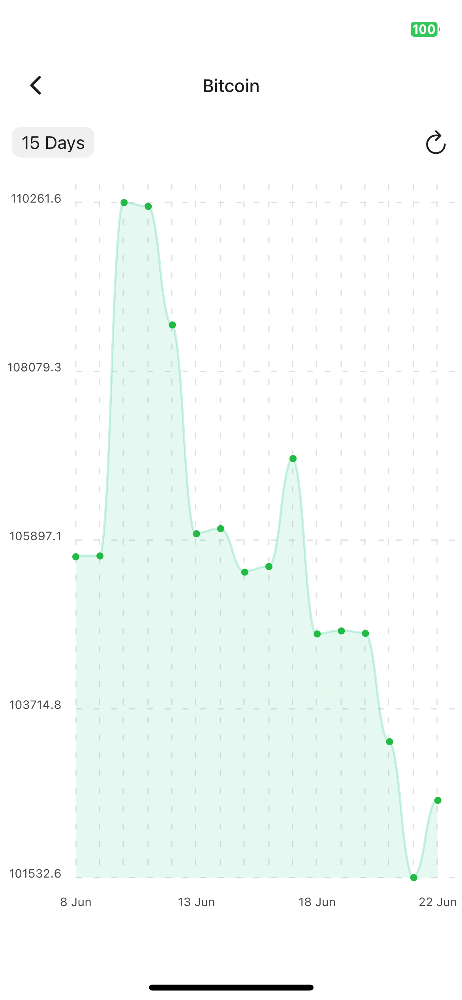
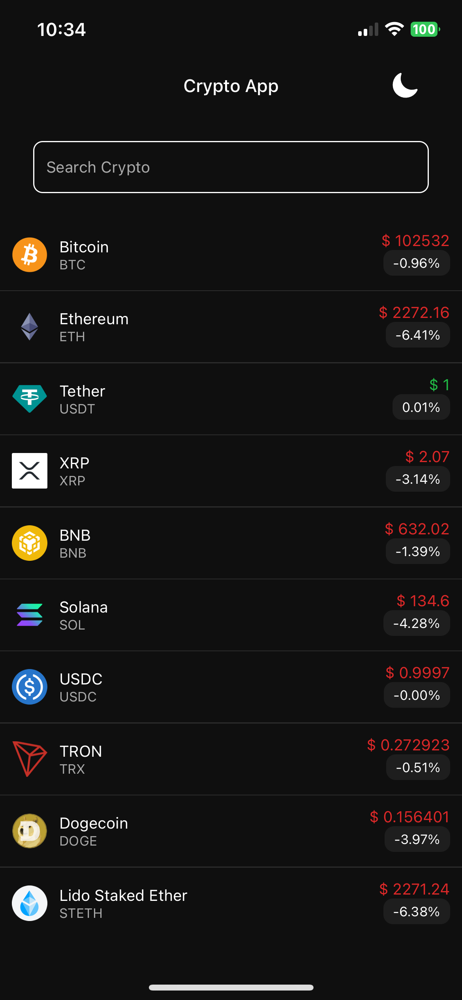

# 📱 About This App

A clean mobile app to track cryptocurrency prices and market trends built with React Native.

---

## ✨ Main Features

- View cryptocurrency prices and market data
- Interactive price charts
- Pull-to-refresh functionality
- loading states
- Dark/light theme support

---

## 📦 Built With

- React Native (TypeScript)
- Styled Components
- Jest for testing
- ESLint for linting
- React Navigation
- React Native Charts

## 🚀 Scripts

The following scripts are available in the project for development and testing:

| Script            | Description                                      |
| ----------------- | ------------------------------------------------ |
| `npm run android` | Launch the app on an Android emulator/device     |
| `npm run ios`     | Launch the app on an iOS simulator               |
| `npm run lint`    | Run ESLint on the codebase to check code quality |
| `npm start`       | Start the Metro bundler for React Native         |
| `npm test`        | Run unit tests with Jest                         |

## 📁 Project Structure

Here's a simplified view of the folder structure inside the `src/` directory:

```bash

|-- src/
|   |-- assets/ # Images, fonts, icons, etc.
|   |
|   |-- components/ # Shared, reusable UI components
|   |  |-- Button.tsx # "Button" UI component
|   |  |-- ... # Other shared components
|   |
|   |-- redux
|   |
|   |-- screens/
|   |   |-- HomeScreen.tsx
|   |   |-- ... # Other Screens
|   |
|   |-- navigation/
|   |-- service/
|   |-- theme/
|   |-- utils/
|   |-- constants.ts
|   |-- types.ts

```

## 📱 React Native App Setup

To set up and run the project locally using **React Native CLI** and **npm**.

### ✅ Prerequisites

- [Node.js](https://nodejs.org/) (v16 or later recommended)
- [npm](https://www.npmjs.com/) (comes with Node)
- [React Native CLI](https://reactnative.dev/docs/environment-setup) (not Expo)
- Android Studio and/or Xcode (depending on your target platform)
- A physical device or emulator/simulator for testing

---

### 🚀 Getting Started

1. **Clone the repository**

```bash
git clone git@github.com:naveenjadala/Crypto_Coinmerce.git
cd Crypto_Coinmerce

npm install

npm start

(android)
npx react-native run-android

(ios)
npx react-native run-ios
```

## 📸 App Preview

| Home Screen                                 | Detail View                                    | Dark Mode                                   |
| ------------------------------------------- | ---------------------------------------------- | ------------------------------------------- |
|  |  |  |

```

```
